# Ex 1: Utilisation de SLURM (∼30mn, – facile)
## c
Avant d'allouer des GPU:
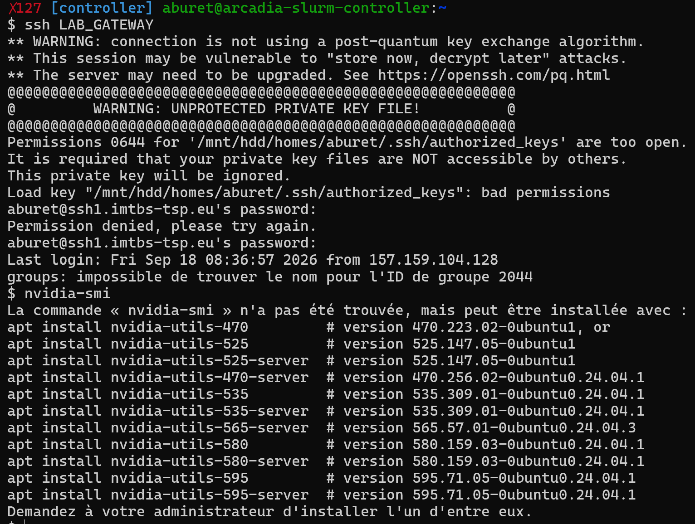

je m'étais trompé.e, il ne fallait pas aller sur le LAB_GATEWAY mais rester sur le controlleur. Le message d'erreur sur le contrôlleur était similaire.
Après avoir exécuté ___nvidia-smi___ on obtient:
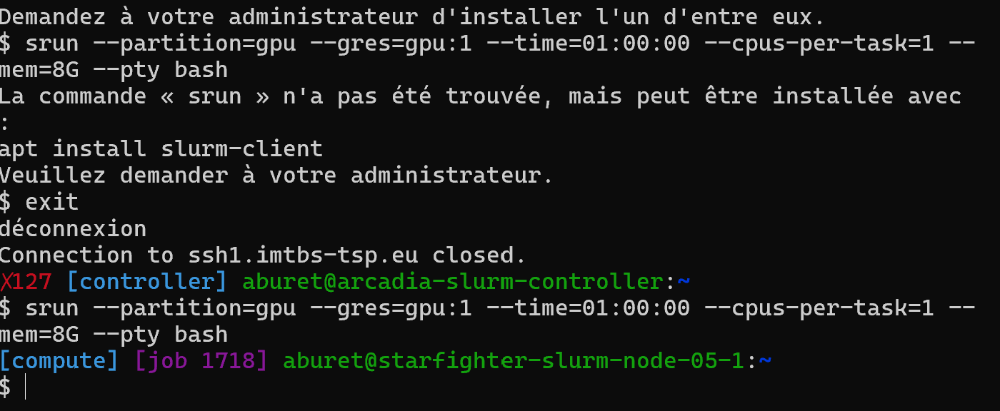
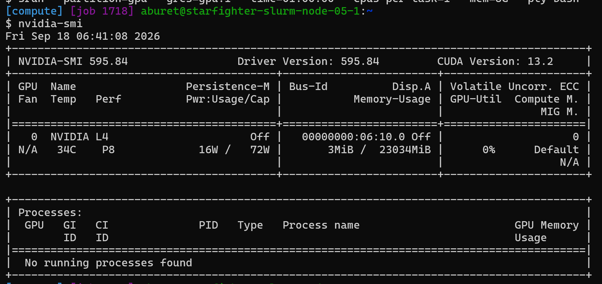

Le modèle de GPU NVIDIA L4 m'a été alloué.
## d
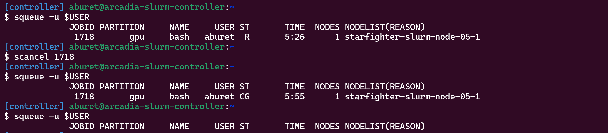

___scancel 1718___
## e
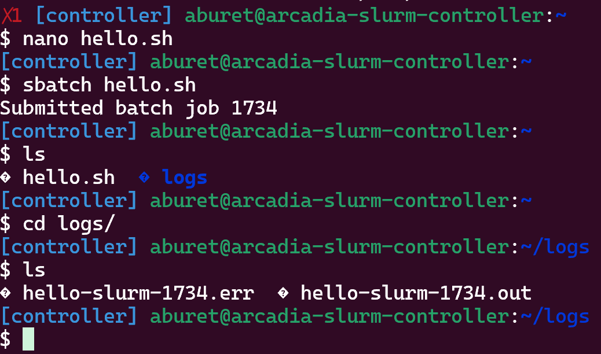

Le nom exact du fichier est ___hello-slurm-1734.out___
## f
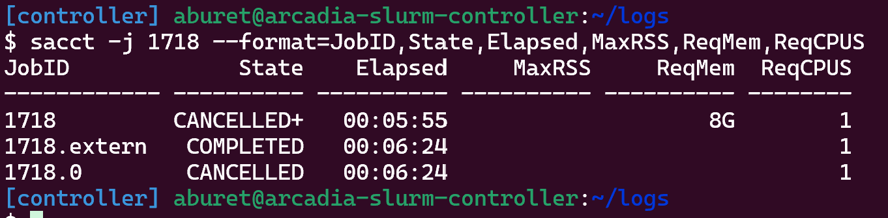

___ReqMem___ correspond à "requested memory", soit la mémoire allouée pour cette tâche. On y retrouve en effet les 8G de RAM alloués précédemment.

___MaxRSS___, lui, correspond à la mémoire utilisée pour réaliser la tâche.

# Ex 2: Création d'un environnement virtuel Python (∼20mn, – facile)
## b
La commande pour obtenir la version est ___python --version___. Pour le chemin du binaire, c'est ___which python___
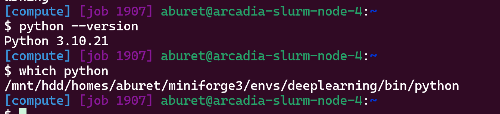

## d

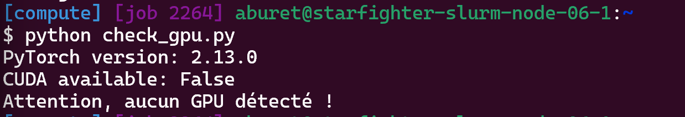

On a probablement ce message d'erreur car ___build CPU-only___ a été installé ou que le GPU est non alloué par Slurm.

## f

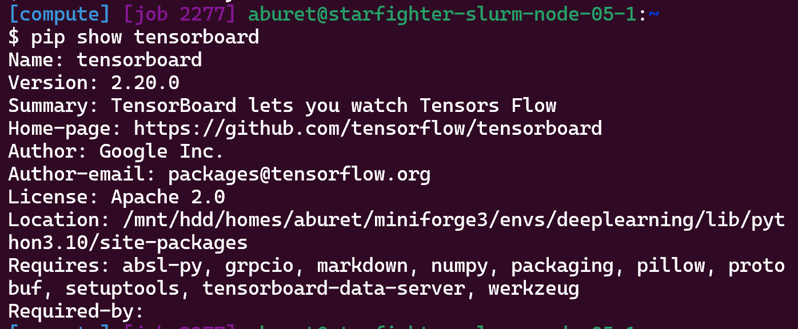
___pip show tensorboard___

# Ex 3: Exercices théoriques (Papier & Markdown) (∼30mn, – moyen) (à faire en dehors de TSP)
## a
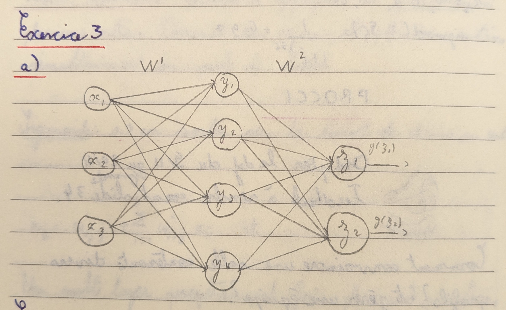

Sans le biais:

$$ Y = X W_1^T $$

$$ Z = Y W_2^T $$

Soient $X \in \mathbb{R}^{1 \times 3}$, $Y \in \mathbb{R}^{1 \times 4}$ et $Z \in \mathbb{R}^{1 \times 2}$.

On a donc $W_1 \in \mathbb{R}^{4 \times 3}$ et $W_2 \in \mathbb{R}^{2 \times 4}$

  

*Couche 1 et cachée*: $4 \times 3$ = 12 poids

*Couche cachée et de sortie*: $4 \times 2$ = 8 poids

  

Il y a **20** paramètres sans biais.

  

Pour la couche cachée, le biais est une matrice qui appartient à $\mathbb{R}^{1 \times 4}$

Pour la couche cachée, le biais est une matrice qui appartient à $\mathbb{R}^{1 \times 2}$

  

Soient **26** paramètres avec biais.

## b

$$H = ReLU( X W_1^T + b_1 )$$

$$Y = H W_2^T + b_2$$

  

Soient m1, m2 dans R

Dimensions :

X  : (N, 3)

W1 : (m1, 3)

b1 : (1, m1) -> diffusé en (N, m1)

H  : (N, m1)

W2 : (m2, m1)

b2 : (1, m2) -> diffusé en (N, m2)

Y  : (N, m2)

## c

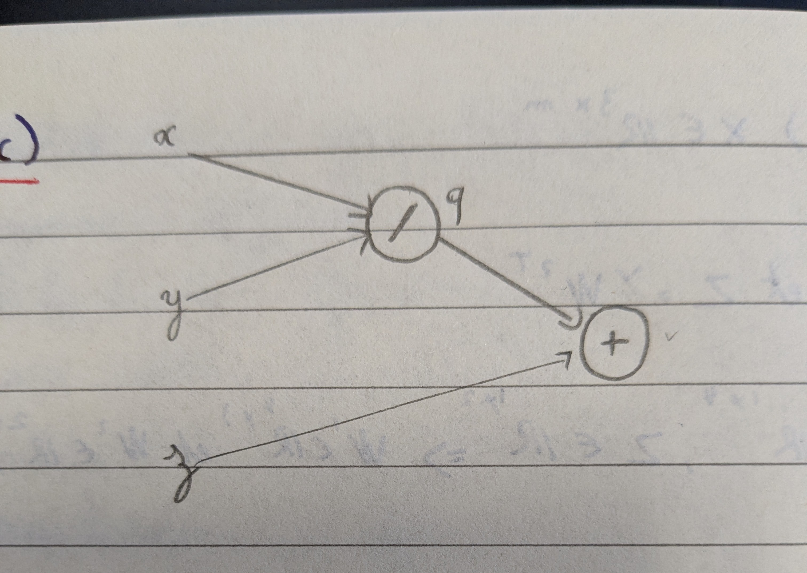

$q = \frac{x}{y}$

$f = q + z$

  

*Forward pass*

$q = \frac{2}{4}$

$q = 0.5$

  
$f = 0.5 + 0$

**$f = 0.5$**

  

*Backpropagation*

$\frac{\partial f}{\partial f} = 1$

$\frac{\partial f}{\partial q} = 1$

$\frac{\partial f}{\partial z} = 1$

  

$\frac{\partial q}{\partial x} = \frac{1}{y}$

$\frac{\partial q}{\partial y} = - \frac{x}{y^2}$

 

$\frac{\partial f}{\partial x} = \frac{\partial f}{\partial q} \frac{\partial q}{\partial x} = \frac{1}{y}$

$\frac{\partial f}{\partial y} = \frac{\partial f}{\partial q} \frac{\partial q}{\partial y} = - \frac{x}{y^2}$

## d

Soient: 

$x' = x - \eta \frac{\partial f}{\partial x}$

$y' = y - \eta \frac{\partial f}{\partial y}$

$z' = z - \eta \frac{\partial f}{\partial z}$

  

$x' = 2 - \frac{1}{4} = \frac{7}{4}$

$y' = 4 + \frac{1}{8} = \frac{33}{8}$

$z' = -1$

  

$f' = \frac{x'}{y'} + z'$

$f' = \frac{7 \times 8}{4 \times 33} - 1$

$f' = - \frac{19}{33}$

$f = \frac{1}{2}$  donc $f' < f$

La valeur de la fonction a diminué comme attendu.

## e

Un réseau profond est une composition de fonctions. La chain rule décompose le gradient global en produit de dérivées locales, calculables couche par couche, au lieu de dériver une expression complexe d'un seul bloc.
Un seul exemple donne un gradient trop bruité. Tout le dataset donne un gradient précis mais trop coûteux à calculer. Le mini-batch est un compromis qui exploite le parallélisme du GPU tout en gardant un gradient stable

## f
Tâche                   | Fonction finale (Sortie) | Fonction de perte (Loss)
------------------------|--------------------------|---------------------------
Classification binaire  | 1. Sigmoïde           | A. Binary Cross-Entropy
Classification multi    | 2. Softmax           | B. Cross-Entropy
Régression pure         | 3. Identité (aucune)     | C. MSE (Mean Squared Error)

# Ex 4: Votre premier réseau de neurones (∼45mn, – moyen)
## a
___batch_size___ fixe le nombre d'exemples traités par mise à jour. ___shuffle___ mélange l'ordre des exemples à chaque époque pour éviter que le modèle apprenne un ordre plutôt que les données. Sur le test, ___shuffle=False___ car aucune mise à jour n'a lieu.

## b
Les images sont en (N, 3, 32, 32) mais ___nn.Linear___ attend (N, features). Aplatir à partir de la dimension 1 garde le batch intact.

CrossEntropyLoss applique déjà ___log_softmax___ ___NLLLoss___ en interne. Ajouter un ___Softmax___ en sortie l'appliquerait deux fois, saturant ainsi les gradients et cassant l'entraînement.
## c
___zero_grad()___ remet à zéro les gradients accumulés. ___backward()___ calcule les nouveaux gradients par rétropropagation. Ni l'un ni l'autre ne met à jour les poids, ça c'est ___optimizer.step()___.

## d
10 classes équilibrées donc environ 10%.

# Ex 5: Utilisation de TensorBoard (∼45mn, – moyen)
## a
Le timestamp évite d'écraser les logs d'un run précédent en cas de relance.

Les hyperparamètres dans le nom permettent d'identifier chaque run directement dans TensorBoard sans rouvrir chaque config.

## d
À 0,99, la tendance ressort sans être noyée dans le bruit batch-à-batch.

Loss/train_step logue la perte d'un seul mini-batch toutes les 10 itérations, donc chaque point reflète le bruit d'échantillonnage stochastique. Loss/train moyenne sur l'époque complète. Donc ce bruit s'annule mécaniquement.
## e (à compléter si possible. Je dois me reconnecter au cluster)

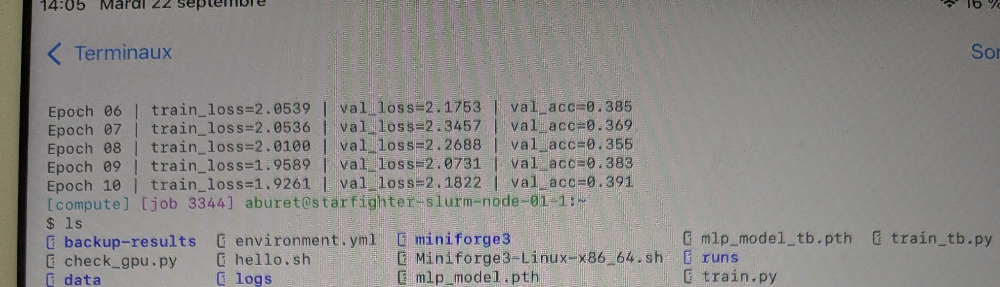